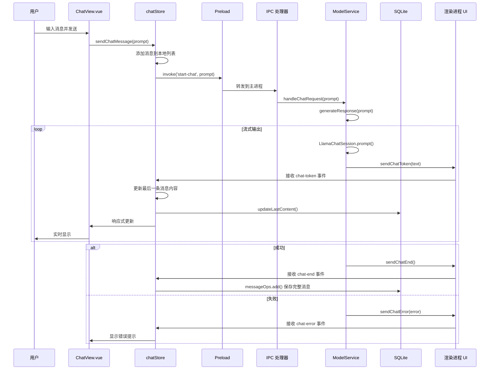
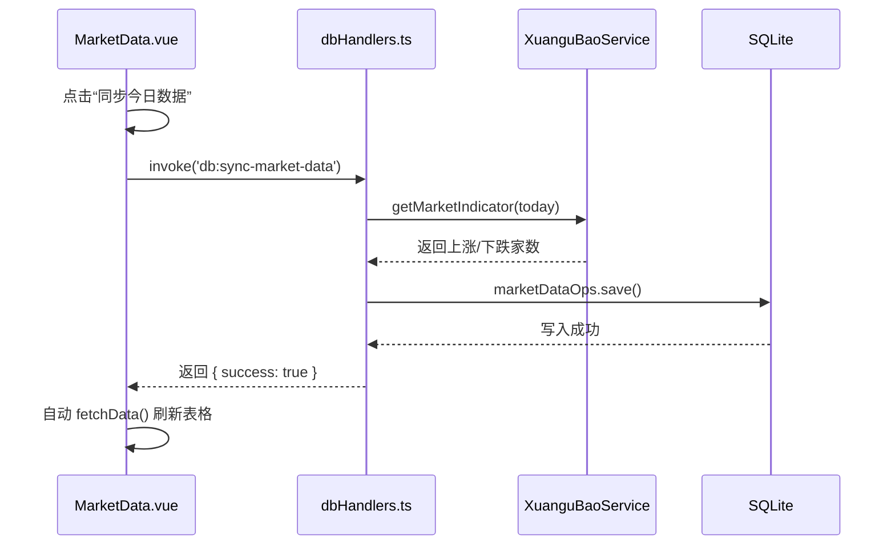
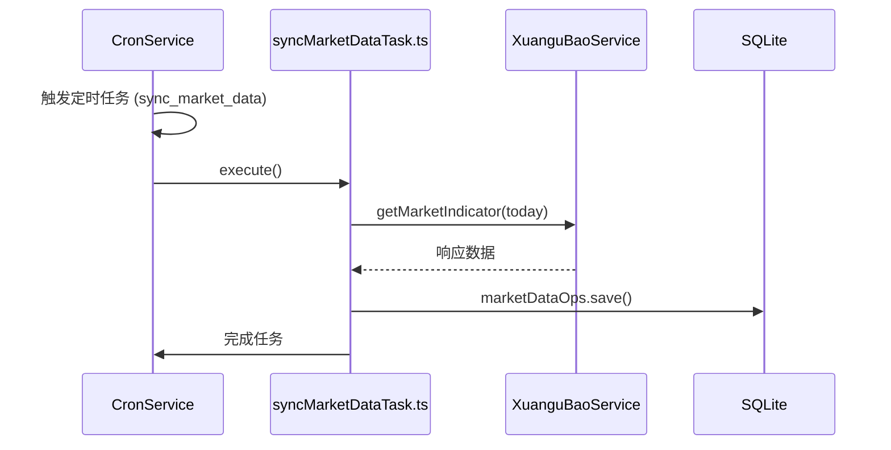

# 系统架构与请求流程

## 📋 目录
- [整体架构](#整体架构)
- [IPC 通信流程](#ipc-通信流程)
- [聊天请求流程](#聊天请求流程)
- [定时任务流程](#定时任务流程)
- [持久化方案](#持久化方案)

---

## 🏗️ 整体架构

```
┌─────────────────────────────────────────────────────────────────────────────┐
│                              渲染进程 (Vue 3)                                │
│  ┌──────────────┐  ┌──────────────┐  ┌──────────────┐  ┌──────────────┐ │
│  │   App.vue    │  │   页面视图     │  │  Pinia Store  │  │   组件层      │ │
│  │              │  │ (Chat/Settings)│  │  (状态管理)    │  │ (StockLink)  │ │
│  └──────┬───────┘  └──────┬───────┘  └──────┬───────┘  └──────┬───────┘ │
│         │                   │                   │                   │         │
│         └───────────────────┴───────────────────┴───────────────────┘         │
│                                     │                                             │
│                          ┌──────────▼──────────┐                                 │
│                          │  window.ipcRenderer  │                                 │
│                          │   (Preload 暴露)     │                                 │
│                          └──────────┬──────────┘                                 │
└─────────────────────────────────────┼─────────────────────────────────────────────┘
                                      │
                                      │ IPC 通信
                                      │
┌─────────────────────────────────────┼─────────────────────────────────────────────┐
│                              主进程 (Electron)                                   │
│  ┌──────────────────────────────────┼──────────────────────────────────────────┐  │
│  │  IPC 处理器层                    │                                         │  │
│  │  ┌──────────────────────────────────────────────────────────────────────┐  │  │
│  │  │ appHandlers.ts      (应用相关)                                        │  │  │
│  │  │ dbHandlers.ts       (数据库)                                           │  │  │
│  │  │ fileHandlers.ts     (文件操作)                                         │  │  │
│  │  │ modelHandlers.ts    (模型管理)                                         │  │  │
│  │  │ tonghuashunHandlers.ts (同花顺联动)                                     │  │  │
│  │  │ cronHandlers.ts     (定时任务)                                         │  │  │
│  │  └──────────────────────────────────────────────────────────────────────┘  │  │
│  └──────────────────────────────────┼──────────────────────────────────────────┘  │
│                                     │                                             │
│  ┌──────────────────────────────────▼──────────────────────────────────────────┐  │
│  │  服务层                                                                      │  │
│  │  ┌──────────────────────────────────────────────────────────────────────┐  │  │
│  │  │ ModelService.ts   (模型加载/聊天生成)                                  │  │  │
│  │  │ WindowManager.ts  (窗口管理)                                           │  │  │
│  │  │ TrayManager.ts    (系统托盘)                                           │  │  │
│  │  │ MenuBuilder.ts    (菜单构建)                                           │  │  │
│  │  │ CronService.ts    (定时任务调度)                                       │  │  │
│  │  │ TongHuaShunService.ts (同花顺联动)                                     │  │  │
│  │  │ XuanguBaoService.ts   (选股通数据抓取) ✨                              │  │  │
│  │  └──────────────────────────────────────────────────────────────────────┘  │  │
│  └──────────────────────────────────┼──────────────────────────────────────────┘  │
│                                     │                                             │
│  ┌──────────────────────────────────▼──────────────────────────────────────────┐  │
│  │  持久化层                                                                     │  │
│  │  ┌──────────────────────────────────────────────────────────────────────┐  │  │
│  │  │ SQLite (better-sqlite3)                                                │  │  │
│  │  │   - sessions (会话表)                                                  │  │  │
│  │  │   - messages (消息表)                                                  │  │  │
│  │  │   - scheduled_tasks (定时任务表)                                      │  │  │
│  │  │                                                                         │  │  │
│  │  │ electron-store (配置存储)                                               │  │  │
│  │  │   - 窗口状态                                                           │  │  │
│  │  │   - 用户设置                                                           │  │  │
│  │  │   - 模型配置                                                           │  │  │
│  │  │                                                                         │  │  │
│  │  │ 文件存储 (userData)                                                    │  │  │
│  │  │   - models/ (GGUF 模型文件)                                           │  │  │
│  │  │   - files/ (用户上传文件)                                              │  │  │
│  │  │   - images/ (图片)                                                     │  │  │
│  │  └──────────────────────────────────────────────────────────────────────┘  │  │
│  └─────────────────────────────────────────────────────────────────────────────┘  │
└─────────────────────────────────────────────────────────────────────────────────────┘
```

---

## 📡 IPC 通信流程

### 1. 请求-响应模式

```
渲染进程                          主进程
   │                               │
   │  window.ipcRenderer.invoke()  │
   │  ───────────────────────────► │
   │                               │
   │                        业务逻辑处理
   │                               │
   │  返回 Promise.resolve()      │
   │  ◄─────────────────────────── │
   │                               │
```

### 2. 主进程主动推送模式

```
渲染进程                          主进程
   │                               │
   │  监听事件                     │
   │  window.ipcRenderer.on()     │
   │                               │
   │                               │  事件触发
   │                               │  mainWindow.webContents.send()
   │  ◄─────────────────────────── │
   │                               │
```

---

## 💬 聊天请求流程

### 完整流程图

```
┌─────────────────────────────────────────────────────────────────────────────────┐
│                            用户发送消息                                           │
│                         (ChatInput.vue)                                         │
└────────────────────────────────────┬────────────────────────────────────────────┘
                                     │
                                     ▼
┌─────────────────────────────────────────────────────────────────────────────────┐
│                       chatStore.sendChatMessage()                                │
│  1. 构建消息对象                                                                 │
│  2. 更新前端状态（添加到消息列表）                                                │
└────────────────────────────────────┬────────────────────────────────────────────┘
                                     │
                                     ▼
┌─────────────────────────────────────────────────────────────────────────────────┐
│                  window.ipcRenderer.invoke('start-chat', prompt)               │
│                  (Preload 暴露的 API)                                           │
└────────────────────────────────────┬────────────────────────────────────────────┘
                                     │
                                     │ IPC 通信
                                     │
┌────────────────────────────────────▼────────────────────────────────────────────┐
│                           IPC 处理器层                                           │
│              modelHandlers.ts: ipcMain.handle('start-chat', ...)               │
└────────────────────────────────────┬────────────────────────────────────────────┘
                                     │
                                     ▼
┌─────────────────────────────────────────────────────────────────────────────────┐
│                        ModelService.handleChatRequest()                          │
│  1. 检查是否有模型加载                                                           │
│  2. 设置 abortController                                                         │
│  3. 调用 generateResponse()                                                       │
└────────────────────────────────────┬────────────────────────────────────────────┘
                                     │
                                     ▼
┌─────────────────────────────────────────────────────────────────────────────────┐
│                        ModelService.generateResponse()                           │
│  ┌───────────────────────────────────────────────────────────────────────────┐ │
│  │ 1. 验证提示词非空                                                          │ │
│  │ 2. 使用 LlamaChatSession.prompt() 生成回复                                │ │
│  │    ┌─────────────────────────────────────────────────────────────────┐   │ │
│  │    │ onTextChunk 回调 (流式输出)                                       │   │ │
│  │    │   - 调用 sendChatToken(text)                                     │   │ │
│  │    │   - 主进程 → 渲染进程推送 (chat-token)                           │   │ │
│  │    └─────────────────────────────────────────────────────────────────┘   │ │
│  │ 3. 生成完成 → sendChatEnd()                                              │ │
│  │ 4. 错误处理 → sendChatError()                                            │ │
│  └───────────────────────────────────────────────────────────────────────────┘ │
└────────────────────────────────────┬────────────────────────────────────────────┘
                                     │
         ┌───────────────────────────┼───────────────────────────┐
         │                           │                           │
         ▼                           ▼                           ▼
┌────────────────┐       ┌────────────────┐       ┌────────────────┐
│  chat-token    │       │   chat-end     │       │  chat-error    │
│  (流式 Token)  │       │  (生成结束)     │       │   (错误)       │
└────────┬───────┘       └────────┬───────┘       └────────┬───────┘
         │                           │                           │
         ▼                           ▼                           ▼
┌─────────────────────────────────────────────────────────────────────────┐
│                        渲染进程 (chatStore)                               │
│  ┌─────────────────────────────────────────────────────────────────────┐ │
│  │ chat-token:                                                           │ │
│  │   - 更新最后一条消息的 content                                         │ │
│  │   - 调用 messageOps.updateLastContent() 保存到数据库                  │ │
│  │                                                                         │ │
│  │ chat-end:                                                              │ │
│  │   - 标记生成完成                                                       │ │
│  │   - 调用 messageOps.add() 保存消息                                    │ │
│  │                                                                         │ │
│  │ chat-error:                                                            │ │
│  │   - 显示错误提示                                                       │ │
│  └─────────────────────────────────────────────────────────────────────┘ │
└────────────────────────────────────┬────────────────────────────────────────┘
                                     │
                                     ▼
┌─────────────────────────────────────────────────────────────────────────┐
│                          ChatView.vue (UI 更新)                          │
│  - 实时显示流式输出                                                       │
│  - 显示错误提示                                                           │
└─────────────────────────────────────────────────────────────────────────┘
```

### 序列图



---

## ⏰ 定时任务流程

### 初始化流程

```
应用启动
   │
   ▼
initBootstrap()
   │
   ├─► initStorageDirs()  [初始化存储目录]
   │
   ├─► initDB()           [初始化 SQLite 数据库]
   │      │
   │      └─► 创建 scheduled_tasks 表
   │
   ├─► initCronService()  [初始化定时任务服务]
   │      │
   │      └─► 获取数据库实例
   │
   ├─► cronOps.loadAndScheduleAll()
   │      │
   │      ├─► 从数据库加载所有任务
   │      │
   │      └─► 对每个 enabled=true 的任务
   │              │
   │              └─► cron.schedule() 调度
   │
   └─► 应用正常运行
```

### 任务执行流程

```
Cron 表达式触发时间到达
   │
   ▼
node-cron 调度器触发
   │
   ▼
cronOps.executeTask(task)
   │
   ├─► 记录日志
   │
   ├─► 更新数据库 last_run_at
   │
   ├─► 根据 taskType 执行不同逻辑
   │      │
   │      ├─► 'cleanup' → 清理任务
   │      │
   │      ├─► 'backup' → 备份任务
   │      │
   │      └─► 其他 → 警告日志
   │
   └─► 异常捕获和日志记录
```

### 任务管理流程（渲染进程调用）

```
渲染进程                          主进程
   │                               │
   │  invoke('cron:create', data) │
   │  ───────────────────────────► │
   │                               │
   │                          cronOps.create(data)
   │                          - 插入数据库
   │                          - 如果 enabled=true，立即调度
   │                               │
   │  返回创建的任务对象           │
   │  ◄─────────────────────────── │
   │                               │
```

---

## 📊 市场数据同步流程

### 1. 手动同步（UI 触发）



### 2. 定时同步（Cron 触发）



---

## 💾 持久化方案

### 三层存储架构

| 层级 | 技术 | 用途 | 存储位置 |
|------|------|------|----------|
| **配置层** | electron-store | 简单键值配置 | userData/app-config.json |
| **业务层** | better-sqlite3 | 会话、消息、定时任务 | userData/database.sqlite |
| **文件层** | Node.js fs | 模型、图片、文件 | userData/storage/ |

### 数据库表结构

#### sessions（会话表）
```sql
CREATE TABLE sessions (
  id TEXT PRIMARY KEY,
  title TEXT NOT NULL,
  created_at INTEGER NOT NULL,
  updated_at INTEGER NOT NULL
);
CREATE INDEX idx_sessions_updated_at ON sessions(updated_at DESC);
```

#### messages（消息表）
```sql
CREATE TABLE messages (
  id INTEGER PRIMARY KEY AUTOINCREMENT,
  session_id TEXT NOT NULL,
  role TEXT NOT NULL,
  content TEXT NOT NULL,
  created_at INTEGER NOT NULL,
  FOREIGN KEY (session_id) REFERENCES sessions(id) ON DELETE CASCADE
);
CREATE INDEX idx_messages_session_id ON messages(session_id);
CREATE INDEX idx_messages_created_at ON messages(created_at ASC);
```

#### scheduled_tasks（定时任务表）
```sql
CREATE TABLE scheduled_tasks (
  id INTEGER PRIMARY KEY AUTOINCREMENT,
  name TEXT NOT NULL UNIQUE,
  cron_expression TEXT NOT NULL,
  task_type TEXT NOT NULL,
  enabled INTEGER DEFAULT 1,
  last_run_at INTEGER,
  next_run_at INTEGER,
  created_at INTEGER NOT NULL,
  updated_at INTEGER NOT NULL
);
```

---

## 📁 文件结构

```
one/
├── electron/                    # 主进程代码
│   ├── constants/              # 常量
│   │   └── index.ts            # IPC 通道、配置等
│   ├── database/               # 数据库层
│   │   ├── index.ts            # 统一导出
│   │   ├── sqlite.ts           # SQLite 操作
│   │   └── fileStorage.ts      # 文件存储
│   ├── services/               # 服务层
│   │   ├── core/               # 核心服务
│   │   │   ├── appBootstrap.ts # 应用启动引导
│   │   │   └── cronService.ts  # 定时任务服务 ✨
│   │   ├── ipc/                # IPC 处理器
│   │   │   ├── ipcRegistry.ts  # 注册中心
│   │   │   ├── appHandlers.ts
│   │   │   ├── dbHandlers.ts
│   │   │   ├── fileHandlers.ts
│   │   │   ├── tonghuashunHandlers.ts
│   │   │   └── cronHandlers.ts # 定时任务 IPC ✨
│   │   ├── models/             # 模型服务
│   │   │   └── modelService.ts
│   │   ├── storage/            # 存储服务
│   │   │   └── index.ts
│   │   └── ui/                 # UI 服务
│   │       ├── windowManager.ts
│   │       ├── trayManager.ts
│   │       └── menuBuilder.ts
│   ├── store/                  # electron-store
│   │   └── index.ts
│   ├── types/                  # 类型定义
│   ├── utils/                  # 工具函数
│   ├── main.ts                 # 主进程入口
│   └── preload.ts              # Preload 脚本
│
├── src/                        # 渲染进程代码
│   ├── components/             # 组件
│   ├── composables/            # Composables
│   ├── constants/              # 常量
│   ├── database/               # Dexie (未使用)
│   ├── layouts/                # 布局
│   ├── router/                 # 路由
│   ├── stores/                 # Pinia Stores
│   ├── types/                  # 类型定义
│   ├── utils/                  # 工具函数
│   ├── views/                  # 页面视图
│   ├── App.vue                 # 根组件
│   └── main.ts                 # 渲染进程入口
│
└── docs/                       # 文档 ✨
    ├── ARCHITECTURE.md         # 本文档
    ├── PERSISTENCE.md          # 持久化方案
    └── DEVELOPMENT.md          # 开发文档
```
